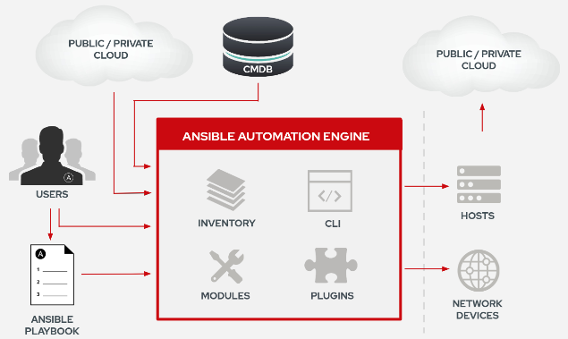
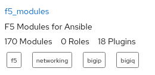

# Ansible Workshop

  * [Introduction](#introduction)
    * [What's Ansible](#whats-ansible)
    * [Installation](#installation)
    * [The key to success](#the-key-to-success)
      * [Linux](#linux)
      * [Win](#win)
    * [Localhost sweet localhost](#localhost-sweet-localhost)
    * [Inventories](#inventories)
    * [Ansible Configuration](#ansible-configuration)
  * [Let's automate the world](#lets-automate-the-world)
    * [Principles](#principles)
    * [Write with style](#write-with-sytle)
    * [Module documentation](#module-documentation)
    * [No fake news, only facts](#no-fake-news-only-facts)
    * [Structures](#structure)
      * [When and Loop](#when-and-loop)
      * [Variables](#variables)
    * [Playbook - will it be my first](#playbook---will-it-be-my-first)
    * [More Structure](#more-structures)
      * [Handling Handling](#handling-handling)
      * [Can you keep a secret?](#can-you-keep-a-secret)
      * [If only](#if-only)
      * [Tag along](#tag-along)
      * [API](#api)
    * [Playbook - Welcome the new user](#playbook---welcome-the-new-user)
    * [Roles](#roles)
        * [Path to the role](#path-to-the-role)
        * [Role](#role)
    * [A window to the world](#a-window-to-the-world)
      * [Use Cases](#use-cases)
        * [Install IIS](#install-iis)
        * [Website](#website)
        * [Web Content](#web-content)
        * [Install MSI Package](#install-msi-package)
        * [Install IBM Software](#install-ibm-software)
        * [Configure F5](#configure-f5)
        * [Qualys Scan](#qualys-scan)
        * [Trigger a deployment via ARA](#trigger-a-deployment-via-ara)
    * [Parked Questions](#parked-questions)
      * [Local Facts](#local-facts)
      * [Playbook hanging](#playbook-hanging)
      * [Special variables](#special-variables)
      * [Playbook Control](#playbook-control)
    * [Dynamic Inventory](#dynamic-inventory)
      * [Inventory Scripts](#inventory-scripts)
      * [Inventory Plugins](#inventory-plugins)

## Introduction
This repository is a run through Ansible components providing the necessary hands-on to build automation with a good set of principles and best practices. This is not a course.

### what's Ansible?
In a nutshell, Ansible is a mean to execute remotely without any agent some tasks that have been written within a descriptive language.



Idempotent
```
Being idempotent allows the defined task to run one time or a thousand times without having an adverse effect on the target system, only ever making the change once. 
In other words, if a change is required to get the system into its desired state, the change is made; and if the device is already in its desired state, no change is made. 
This is unlike most traditional custom scripts and the copy and pasting of CLI commands into a terminal window. When the same command or script is executed repeatedly on the same system, errors are (sometimes) raised.
```
— Jason Edelman
Network Automation with Ansible

### Installation
The installation is straight forward since Ansible is available within almost all major distributions like CentOS/RHEL. For more details: https://docs.ansible.com/ansible/latest/installation_guide/intro_installation.html

### The key to success
Ansible is agent-less and doesn't work in a pull approach but in push with credentials.

#### Linux
When it comes to Linux, the connection towards the target is done through SSH.
This is a very basic process, unless SSH has been disabled, only a valid user with SUDO rights is necessary along with a password-less connection. 

To do so, have a bit of play with: 
```
ssh-keygen
ssh-copy-id user@host
ssh user@host
```
#### Win
When it comes to Windows, the connection towards the target is done through WinRM.
Since Windows Vista, WinRM is shipped standard with Windows but needs to be enabled. 
Here is two references to make it happen painless:
* The following powershell script can be used to enable it:
https://github.com/ansible/ansible/tree/devel/examples/scripts 
* A good blog post about to connect to a Windows host:
https://www.ansible.com/blog/connecting-to-a-windows-host 


### Localhost sweet localhost
After installing Ansible, the following can be tried:
```
ansible localhost -m ping
```
The expected outcome is:
```
localhost | SUCCESS => {
    "changed": false, 
    "ping": "pong"
}
```
Then try the following:
```
ansible localhost -m setup
``` 
Let's discuss about facts for 2 minutes, then forgot about it for a couple of hours and come back to it.

### Inventories
Ansible inventories are much more than just a list of target to run automation on and as such it deserves some real attention with some best practices.

Here is a bad example:

```
[mydb]
10.1.2.3
10.1.2.4

[myweb]
myhost01.mydomain.com
myhost02.mydomain.com
```
The above is indeed just a list with no real interest or power features.
What about this one:

```
[mydb]
db1     ansible_host=10.1.2.3
db2     ansible_host=10.1.2.4

[myweb]
web1    ansible_host=myhost01.mydomain.com
web2    ansible_host=myhost02.mydomain.com
```
Then, the concept of groups can be used to make easier automation
```
[mydb]
db1     ansible_host=10.1.2.3
db2     ansible_host=10.1.2.4

[myweb]
web1    ansible_host=myhost01.mydomain.com
web2    ansible_host=myhost02.mydomain.com

[dev]
db1
web1

[uat]
db2
web2
``` 
This inventory will allow to deploy a common set of packages and configurations towards 'mydb' and 'myweb' then deploy the application set towards a the group 'dev' and/or 'uat' with key differentiator like data set, testings, ... 

The last addition to the inventory is about variables liked to it like:
```
[dev:vars]
var1=valuexyz
var2=valueyxz
```
When working with a large or/and complex inventory, the following CLI commands are useful:
```
$ ansible-inventory -i 101/examples/ --list
{
    "_meta": {
        "hostvars": {
            "db1": {
                "ansible_host": "10.1.2.3"
            }, 
            "db2": {
                "ansible_host": "10.1.2.4"
            }, 
            "web1": {
                "ansible_host": "myhost01.mydomain.com"
            }, 
            "web2": {
                "ansible_host": "myhost02.mydomain.com"
            }
        }
    }, 
    "all": {
        "children": [
            "dev", 
            "mydb", 
            "myweb", 
            "uat", 
            "ungrouped"
        ]
    }, 
    "dev": {
        "hosts": [
            "db1", 
            "var1=valuexyz", 
            "var2=valueyxz", 
            "web1"
        ]
    }, 
    "mydb": {
        "hosts": [
            "db1", 
            "db2"
        ]
    }, 
    "myweb": {
        "hosts": [
            "web1", 
            "web2"
        ]
    }, 
    "uat": {
        "hosts": [
            "db2", 
            "web2"
        ]
    }
}

$ ansible-inventory -i 101/examples/  --graph
@all:
  |--@dev:
  |  |--db1
  |  |--var1=valuexyz
  |  |--var2=valueyxz
  |  |--web1
  |--@mydb:
  |  |--db1
  |  |--db2
  |--@myweb:
  |  |--web1
  |  |--web2
  |--@uat:
  |  |--db2
  |  |--web2
  |--@ungrouped:
```
Note how the variables have been merged with their respective group of hosts.

### Ansible Configuration
Let's rewind a bit! So far the topics of installation, connection, and inventory have been discussed. It's time to get a view on how to impact them on a global scale with the "ansible.cfg" config that can be present at the following locations:
* /etc/ansible/ansible.cfg      (global and first in line)
* ~/.ansible.cfg    (hidden file in user home directory)
* ./ansible.cfg     (current directory)

A custom version of the file can be as simple as:

```
[defaults]
inventory = ./inventory
remote_user = user
ask_pass = false

[privilege_escalation]
become = true
become_method = sudo
become_user = root
become_ask_pass = false
``` 
Note that these newly defined values can be overridden in playbook or with CLI options. The content of the "/etc/ansible/ansible.cfg" is available within this repository for reference.

The ansible binaries will check those location and pick one of them considering the precedence of each of them. To verify which configuration file has been taken by the binaries, the following command can be used:

```
$ ansible --version
ansible 2.9.1
  config file = /etc/ansible/ansible.cfg
  configured module search path = [u'/home/rovandep/.ansible/plugins/modules', u'/usr/share/ansible/plugins/modules']
  ansible python module location = /usr/lib/python2.7/site-packages/ansible
  executable location = /usr/bin/ansible
  python version = 2.7.5 (default, Sep 26 2019, 13:23:47) [GCC 4.8.5 20150623 (Red Hat 4.8.5-39)]

```

## Let's automate the world

### Principles 
Some principles to keep in mind during this workshop and as takeaways:
* automation should be considered as coding and as such the content should be hosted on version-control system like Git. 
* better have a KISS than a sorry... Keep It Stupid Simple; start with basic playbook and static inventory then fluff© it up
* plan-create-test-(feedback-)deliver loop (think DevOps) then refactor and modularize later
* use modules as much as possible!
* resort to using shell or command only when a module is not available

As reference to keep closed-by:
* https://docs.ansible.com/ansible/latest/user_guide/playbooks_best_practices.html

### Write with style
Along with the thousands benefits of using Ansible, one "cons" is definitely linked to YAML and the strict syntax that will give any Automation Engineers some head scratching and some swearing...

So:
* be consistent with your indenting 
* indentation is done with space not tab
* use linting module in your favorite Code editor
* plan-create-test-(feedback-)deliver loop (think DevOps) then refactor and modularize later

The two following tasks will produce exactly the same but the second one is the preferred approach for ease of reading:
```
- name: http service
  service: name=httpd state=started enabled=yes
```

```
- name: http service
  service:
    name: httpd
    state: started
    enabled: yes
```

### Module documentation
At the time of writing this workshop, the module listing is available at the following link: https://docs.ansible.com/ansible/latest/modules/modules_by_category.html 

When there is no direct access to the internet, the following can be used to list and access module documentation:
```
ansible-doc -l
ansible-doc <module name>
ansible-doc service
```
All module documentation comes with a parameter tables and examples which are really useful to start writing a playbook. Use them without moderation!

### No fake news, only facts
Remember the big blob:
```
ansible localhost -m setup
``` 
The big blob is the identity card of the host, in this case the localhost.

What about making a first playbook (101-01-local-facts.yml) to illustrate the usage of facts:
```
---
- name: playing with facts
  hosts: localhost
  gather_facts: true

  tasks:
  - debug: 
      var: ansible_facts 
  - debug: 
      msg: "Host {{ ansible_hostname }} runs {{ ansible_distribution }}"

```
The above returns:
* all the facts (gather_facts is true) for the localhost (defined as hosts)
* the message with the hostname and distribution type of the localhost

Note that the "{{ some_name }}" is how to call a variable's value. The variable assignment will define the type which will influence how to access the data in. Let's extend the previous example (101-02-more-facts.yml):
```
---
- name: playing with facts
  hosts: localhost
  gather_facts: true

  tasks:
  - debug:
      msg: 
        - " Data type of 'ansible_hostname'  is {{ ansible_hostname | type_debug }} "
        - " Data type of 'ansible_selinux' is {{ ansible_selinux | type_debug }} "
        - " Data type of 'ansible_all_ipv4_addresses' is {{ ansible_all_ipv4_addresses | type_debug }} "
  - debug:
      msg: "{{ ansible_all_ipv4_addresses }}"
  - debug:
      msg: "{{ ansible_all_ipv4_addresses[0] }}"
```
The above will provide with the actual type of three different facts. The most interesting one is the list as it will return the full list unless specified otherwise like here when accessing the first item of the related list.
```
TASK [debug] ********************************************************************************************************
ok: [localhost] => {
    "msg": [
        " Data type of 'ansible_hostname'  is AnsibleUnsafeText ",
        " Data type of 'ansible_selinux' is dict ",
        " Data type of 'ansible_all_ipv4_addresses' is list "
    ]
}

TASK [debug] ********************************************************************************************************
ok: [localhost] => {
    "msg": [
        "192.168.130.1",
        "10.36.114.239",
        "192.168.122.1",
        "192.168.1.42"
    ]
}

TASK [debug] ********************************************************************************************************
ok: [localhost] => {
    "msg": "192.168.130.1"

```

### Structures

#### When and Loop
Display information and variable's value are great but some interaction would be nice. 
```
---
- name: playing with facts
  hosts: localhost
  gather_facts: true

  tasks:
  - debug: 
      msg: less than 2000mb
    when: ansible_memtotal_mb <= 2000
  - debug: 
      msg: more than 2000mb
    when: ansible_memtotal_mb >= 2000
  - debug: 
      msg: "My IPv4 addresses are {{ item }}"
    loop: "{{ ansible_all_ipv4_addresses }}"
```
The "when" along with a relational operators (there are logical ones too) will, based on the total RAM on the system, either print that it is more or less than 2000mb.
The "loop" will go through the list and print a message for each "item".

See 101-03-algo-facts.yml

#### Variables
The above example called values from variables but what about defining variables. Ansible allows you to alter value of variables with more than 22 ways, but all having a precedence order. Be careful!

Here is a playbook (101-04-vars-vars.yml) defining the concept of global and local assignment:
```
---
- name: playing with facts
  hosts: localhost
  gather_facts: false

  vars:
    packages: git

  tasks:
  - debug: 
      msg: "My package is {{ packages }}"
  - debug: 
      msg: "My packages is {{ packages }}"
    vars:
      packages:
        - httpd
        - httpd-tools
  - debug: 
      msg: "My packages is {{ item }}"
    loop: "{{ packages }}"
    vars:
      packages:
        - httpd
        - httpd-tools
  - debug: 
      msg: "My package is still {{ packages }}"
```
The debugs two and three override the global definition of the variable "packages" while not impact the last one still accessing the global assignment like the first debug.

As a last example of value assignment, run the same playbook calling the "parameters.yml" the extra variables argument like this:
```
ansible-playbook 101-4-vars-vars.yml -e "@parameters.yml"
```
The conclusion of this last example shows the precedence effect of value assignment to variables. The extra variables argument is winning over all other assignments in this case.

### Playbook - will it be my first
Ok... well let's get to it! What is required?

* an inventory
* a playbook
* some facts
* KISS (the principles ;) 
* know about facts
* know about the rules
* know about the modules

Here it is: 101-5-first_real_play.yml (this one is hosted but was fully created by the team). The play is about a summary of all the previous points automating a deployment of a series of packages specific to the host groups and deploy a jinja2 template as web page generated with the hostname of the  web servers:

Playbook:
```
---
- name: install services to db and http hosts
  hosts: all
  gather_facts: true

  tasks:
  - name: install service
    yum:
      name: "{{ packages }}"
      state: latest
  - name: start service
    service: 
      name: "{{ service }}"
      enabled: yes
      state: started
  - name: deploy index test template
    template: 
      src: 101-4-index.j2
      dest: /var/www/html/index.html
    when: role == "web"
```

Inventory:
```
[mydb]
db1     ansible_host=10.1.2.3
db2     ansible_host=10.1.2.4

[myweb]
web1    ansible_host=myhost01.mydomain.com
web2    ansible_host=myhost02.mydomain.com

[mydb:vars]
packages="mysql"
service="mysqld"
role="db"

[myweb:vars]
packages="httpd,httpd-tools"
service="httpd"
role="web"
```

Jinja2 template:
``` 
Hello from {{ ansible_hostname }}
``` 

### More structures 

#### Handling Handling
Handler can be seen as a specific inactive tasks unless when being triggered by other tasks. This task will run one time after all the other tasks have completed successfully (or ignore_error is used). This last statement has an exception which can be trigger with flush_handlers but will be discussed here.

```
---
- name: install services to db and http hosts
  hosts: all
  gather_facts: true

  tasks:
  - name: install service
    yum:
      name: "{{ packages }}"
      state: latest

  - name: deploy index test template
    template: 
      src: 101-4-index.j2
      dest: /var/www/html/index.html
    when: role == "web"
    notify: restart service

# more tasks to be executed 
# then the handler    

  handlers:
  - name: restart service
    service: 
      name: "{{ service }}"
      enabled: yes
      state: started
``` 

See 101-6-handler.yml 

#### Can you keep a secret?
Ansible comes with a Vault to keep the secrets from untrusty eyes. Here is the step to use the Vault:

```
ansible-vault create vault.yml
``` 
This will ask for a Vault password and then open the file with the local editor.
Insert the following line:

```
mysecret: myuser
```

Then call include the Vault within the playbook:
```
---
- name: playing with vault
  hosts: localhost
  gather_facts: no

#  include_vars:
#    file: vault.yml

  vars_files:
    - vault.yml

  tasks:
  - name: display a secret
    debug:
      var: mysecret
``` 

To execute a playbook with a Vault use the following:

```
ansible-playbook --ask-vault-pass playbook.yml
``` 

A very good reference of all the combination can be found here: https://www.digitalocean.com/community/tutorials/how-to-use-vault-to-protect-sensitive-ansible-data-on-ubuntu-16-04

Let's use the 101-7-vault folder to create a vault file and use it in a playbook.

#### If only...
While using the "when", the need of "if" has been expressed a couple of time. Here is an example how to provide a value based on another one:

```
---
- hosts: localhost  
  gather_facts: false

  vars:
    - test: "{{ 'oof' if myvar == 'foo' else 'rab' }}"
  tasks:
  - debug:
      msg: "myvar is {{ myvar}} giving the value {{ test }}"
``` 
With as results:

```
$ ansible-playbook test.yml -e "myvar=foo"

PLAY [localhost] *********************************************************************************************************

TASK [debug] *************************************************************************************************************
ok: [localhost] => {
    "msg": "myvar is foo giving the value oof"
}

PLAY RECAP ***************************************************************************************************************
localhost                  : ok=1    changed=0    unreachable=0    failed=0    skipped=0    rescued=0    ignored=0   

$ ansible-playbook test.yml -e "myvar=foobar"

PLAY [localhost] *********************************************************************************************************

TASK [debug] *************************************************************************************************************
ok: [localhost] => {
    "msg": "myvar is foobar giving the value rab"
}

PLAY RECAP ***************************************************************************************************************
localhost                  : ok=1    changed=0    unreachable=0    failed=0    skipped=0    rescued=0    ignored=0   

```

See 101-8-if.yml

#### Tag along
Tags a "sticker" to be added to tasks in order to get the ability to run only some of the tasks based on the tasks.

Playbook:
```
---
- name: playing with tags
  hosts: localhost
  gather_facts: no

  tasks:
  - name: first task
    shell: echo hello Jo
    tags: jo

  - name: second task
    shell: echo hello Jane
    tags: jane

  - name: third task
    shell: echo Jo is the best
    tags: jo

  - name: fourth take
    shell: echo Jane is the best
    tags: jane
``` 

Here is how to illustrate the behavior:
```
ansible-playbook 101-09-tag.yml
ansible-playbook 101-09-tag.yml --tags "jo" 
ansible-playbook 101-09.tag.yml --tags "jane"
```

See 101-09-tag.yml

#### API
Obviously all modern software come with a mean to reach without the need of specific set of tools. This is known as a REST API based on the HTTP(s) protocol. Ansible as a specific module to do so. Here is an example to execute a job within tower:

Playbook:
```
---
- name: playing with APIs
  hosts: localhost
  gather_facts: false

  # vars_files:
  #   - vault.yml

  tasks:

  - name: Verify a simple API GET  
    uri:
      url: https://192.168.122.11/api/v2
      validate_certs: no
    register: apiresponse

  - debug:
      var: apiresponse

  - name: Verify JOB status
    uri:
      url: https://192.168.122.11/api/v2/jobs/2
      method: GET
      validate_certs: no
      user: admin
      password: #usevault or a token
      force_basic_auth: yes
      body_format: json
    register: jobstatus

  - debug:
      var: jobstatus

```

The response:
```
PLAY [playing with APIs] ********************************************************************************************

TASK [Verify a simple API GET] **************************************************************************************
ok: [localhost]

TASK [debug] ********************************************************************************************************
ok: [localhost] => {
    "apiresponse": {
        "allow": "GET, HEAD, OPTIONS",
        "cache_control": "no-cache, no-store, must-revalidate",
        "changed": false,
        "connection": "close",
        "content_language": "en",
        "content_length": "1688",
        "content_security_policy": "default-src 'self'; connect-src 'self' *.pendo.io ws: wss:; style-src 'self' 'unsafe-inline'; script-src 'self' 'unsafe-inline' *.pendo.io; img-src 'self' *.pendo.io data:; report-uri /csp-violation/",
        "content_type": "application/json",
        "cookies": {},
        "cookies_string": "",
        "date": "Thu, 14 May 2020 06:44:33 GMT",
        "elapsed": 0,
        "expires": "0",
        "failed": false,
        "json": {
            "activity_stream": "/api/v2/activity_stream/",
            "ad_hoc_commands": "/api/v2/ad_hoc_commands/",
            "applications": "/api/v2/applications/",
            "config": "/api/v2/config/",
            "credential_input_sources": "/api/v2/credential_input_sources/",
            "credential_types": "/api/v2/credential_types/",
            "credentials": "/api/v2/credentials/",
            "dashboard": "/api/v2/dashboard/",
            "groups": "/api/v2/groups/",
            "hosts": "/api/v2/hosts/",
            "instance_groups": "/api/v2/instance_groups/",
            "instances": "/api/v2/instances/",
            "inventory": "/api/v2/inventories/",
            "inventory_scripts": "/api/v2/inventory_scripts/",
            "inventory_sources": "/api/v2/inventory_sources/",
            "inventory_updates": "/api/v2/inventory_updates/",
            "job_events": "/api/v2/job_events/",
            "job_templates": "/api/v2/job_templates/",
            "jobs": "/api/v2/jobs/",
            "labels": "/api/v2/labels/",
            "me": "/api/v2/me/",
            "metrics": "/api/v2/metrics/",
            "notification_templates": "/api/v2/notification_templates/",
            "notifications": "/api/v2/notifications/",
            "organizations": "/api/v2/organizations/",
            "ping": "/api/v2/ping/",
            "project_updates": "/api/v2/project_updates/",
            "projects": "/api/v2/projects/",
            "roles": "/api/v2/roles/",
            "schedules": "/api/v2/schedules/",
            "settings": "/api/v2/settings/",
            "system_job_templates": "/api/v2/system_job_templates/",
            "system_jobs": "/api/v2/system_jobs/",
            "teams": "/api/v2/teams/",
            "tokens": "/api/v2/tokens/",
            "unified_job_templates": "/api/v2/unified_job_templates/",
            "unified_jobs": "/api/v2/unified_jobs/",
            "users": "/api/v2/users/",
            "workflow_approvals": "/api/v2/workflow_approvals/",
            "workflow_job_nodes": "/api/v2/workflow_job_nodes/",
            "workflow_job_template_nodes": "/api/v2/workflow_job_template_nodes/",
            "workflow_job_templates": "/api/v2/workflow_job_templates/",
            "workflow_jobs": "/api/v2/workflow_jobs/"
        },
        "msg": "OK (1688 bytes)",
        "pragma": "no-cache",
        "redirected": true,
        "server": "nginx",
        "status": 200,
        "strict_transport_security": "max-age=15768000",
        "url": "https://192.168.122.11/api/v2/",
        "vary": "Accept, Accept-Language, Origin, Cookie",
        "x_api_node": "localhost",
        "x_api_time": "0.032s",
        "x_api_total_time": "0.072s",
        "x_content_security_policy": "default-src 'self'; connect-src 'self' *.pendo.io ws: wss:; style-src 'self' 'unsafe-inline'; script-src 'self' 'unsafe-inline' *.pendo.io; img-src 'self' *.pendo.io data:; report-uri /csp-violation/",
        "x_frame_options": "DENY"
    }
}

TASK [Verify JOB status] ********************************************************************************************
ok: [localhost]

TASK [debug] ********************************************************************************************************
ok: [localhost] => {
    "jobstatus": {
        "allow": "GET, DELETE, HEAD, OPTIONS",
        "cache_control": "no-cache, no-store, must-revalidate",
        "changed": false,
        "connection": "close",
        "content_language": "en",
        "content_length": "6442",
        "content_security_policy": "default-src 'self'; connect-src 'self' *.pendo.io ws: wss:; style-src 'self' 'unsafe-inline'; script-src 'self' 'unsafe-inline' *.pendo.io; img-src 'self' *.pendo.io data:; report-uri /csp-violation/",
        "content_type": "application/json",
        "cookies": {},
        "cookies_string": "",
        "date": "Thu, 14 May 2020 06:44:35 GMT",
        "elapsed": 0,
        "expires": "0",
        "failed": false,
        "json": {
            "allow_simultaneous": false,
            "artifacts": {},
            "controller_node": "",
            "created": "2020-05-11T12:25:52.107943Z",
            "custom_virtualenv": "/var/lib/awx/venv/ansible",
            "description": "",
            "diff_mode": false,
            "elapsed": 3.925,
            "event_processing_finished": true,
            "execution_node": "localhost",
            "extra_vars": "{}",
            "failed": false,
            "finished": "2020-05-11T12:26:05.881809Z",
            "force_handlers": false,
            "forks": 0,
            "host_status_counts": {
                "ok": 1
            },
            "id": 2,
            "instance_group": 1,
            "inventory": 1,
            "job_args": "[\"bwrap\", \"--die-with-parent\", \"--unshare-pid\", \"--dev-bind\", \"/\", \"/\", \"--proc\", \"/proc\", \"--bind\", \"/tmp/ansible_runner_pi_z876bn5k/ansible_runner_pi_m92rgcc1/tmp9pf6n52e\", \"/etc/ssh\", \"--bind\", \"/tmp/ansible_runner_pi_z876bn5k/ansible_runner_pi_m92rgcc1/tmp2r3zi0ul\", \"/etc/tower\", \"--bind\", \"/tmp/ansible_runner_pi_z876bn5k/ansible_runner_pi_m92rgcc1/tmpxs3zosst\", \"/tmp\", \"--bind\", \"/tmp/ansible_runner_pi_z876bn5k/ansible_runner_pi_m92rgcc1/tmp1dkh5ufy\", \"/var/lib/awx\", \"--bind\", \"/tmp/ansible_runner_pi_z876bn5k/ansible_runner_pi_m92rgcc1/tmpyf7w17h2\", \"/var/lib/awx/job_status\", \"--bind\", \"/tmp/ansible_runner_pi_z876bn5k/ansible_runner_pi_m92rgcc1/tmpiiw0x_y4\", \"/var/lib/awx/projects\", \"--bind\", \"/tmp/ansible_runner_pi_z876bn5k/ansible_runner_pi_m92rgcc1/tmpzgyucuu4\", \"/var/log\", \"--ro-bind\", \"/var/lib/awx/venv/ansible\", \"/var/lib/awx/venv/ansible\", \"--ro-bind\", \"/var/lib/awx/venv/awx\", \"/var/lib/awx/venv/awx\", \"--bind\", \"/tmp/awx_2_d8spw8vp\", \"/tmp/awx_2_d8spw8vp\", \"--chdir\", \"/tmp/awx_2_d8spw8vp/project\", \"ansible-playbook\", \"-u\", \"admin\", \"-i\", \"/tmp/awx_2_d8spw8vp/tmp8kie0sce\", \"-e\", \"@/tmp/awx_2_d8spw8vp/env/extravars\", \"hello_world.yml\"]",
            "job_cwd": "/tmp/awx_2_d8spw8vp/project",
            "job_env": {
                "ANSIBLE_CALLBACK_PLUGINS": "/var/lib/awx/venv/awx/lib64/python3.6/site-packages/awx/plugins/callback",
                "ANSIBLE_COLLECTIONS_PATHS": "/tmp/awx_2_d8spw8vp/requirements_collections:~/.ansible/collections:/usr/share/ansible/collections",
                "ANSIBLE_FORCE_COLOR": "True",
                "ANSIBLE_HOST_KEY_CHECKING": "False",
                "ANSIBLE_INVENTORY_UNPARSED_FAILED": "True",
                "ANSIBLE_PARAMIKO_RECORD_HOST_KEYS": "False",
                "ANSIBLE_RETRY_FILES_ENABLED": "False",
                "ANSIBLE_ROLES_PATH": "/tmp/awx_2_d8spw8vp/requirements_roles:~/.ansible/roles:/usr/share/ansible/roles:/etc/ansible/roles",
                "ANSIBLE_SSH_CONTROL_PATH_DIR": "/tmp/awx_2_d8spw8vp/cp",
                "ANSIBLE_STDOUT_CALLBACK": "awx_display",
                "ANSIBLE_VENV_PATH": "/var/lib/awx/venv/ansible",
                "AWX_HOST": "https://192.168.122.11",
                "AWX_ISOLATED_DATA_DIR": "/tmp/awx_2_d8spw8vp/artifacts/2",
                "AWX_PRIVATE_DATA_DIR": "/tmp/awx_2_d8spw8vp",
                "CPATH": "/opt/rh/rh-postgresql10/root/usr/include",
                "DJANGO_LIVE_TEST_SERVER_ADDRESS": "localhost:9013-9199",
                "DJANGO_SETTINGS_MODULE": "awx.settings.production",
                "HOME": "/var/lib/awx",
                "INVENTORY_ID": "1",
                "JAVACONFDIRS": "/etc/opt/rh/rh-postgresql10/java:/etc/java",
                "JOB_ID": "2",
                "LANG": "en_US.UTF-8",
                "LD_LIBRARY_PATH": "/opt/rh/rh-postgresql10/root/usr/lib64:/opt/rh/rh-python36/root/usr/lib64",
                "LIBRARY_PATH": "/opt/rh/rh-postgresql10/root/usr/lib64",
                "MANPATH": "/opt/rh/rh-postgresql10/root/usr/share/man:/opt/rh/rh-python36/root/usr/share/man:",
                "MAX_EVENT_RES": "700000",
                "PATH": "/var/lib/awx/venv/ansible/bin:/var/lib/awx/venv/awx/bin:/opt/rh/rh-postgresql10/root/usr/bin:/opt/rh/rh-python36/root/usr/bin:/usr/local/sbin:/usr/local/bin:/usr/sbin:/usr/bin",
                "PKG_CONFIG_PATH": "/opt/rh/rh-postgresql10/root/usr/lib64/pkgconfig:/opt/rh/rh-python36/root/usr/lib64/pkgconfig",
                "PROJECT_REVISION": "347e44fea036c94d5f60e544de006453ee5c71ad",
                "PROOT_TMP_DIR": "/tmp",
                "PS1": "(awx) ",
                "PWD": "/var/lib/awx",
                "PYTHONPATH": "/var/lib/awx/venv/ansible/lib/python2.7/site-packages:/var/lib/awx/venv/awx/lib64/python3.6/site-packages/awx/lib:",
                "RUNNER_OMIT_EVENTS": "False",
                "RUNNER_ONLY_FAILED_EVENTS": "False",
                "SHLVL": "0",
                "SUPERVISOR_ENABLED": "1",
                "SUPERVISOR_GROUP_NAME": "tower-processes",
                "SUPERVISOR_PROCESS_NAME": "awx-dispatcher",
                "SUPERVISOR_SERVER_URL": "unix:///var/run/supervisor/supervisor.sock",
                "TZ": "UTC",
                "USER": "awx",
                "VIRTUAL_ENV": "/var/lib/awx/venv/ansible",
                "XDG_DATA_DIRS": "/opt/rh/rh-python36/root/usr/share:/usr/local/share:/usr/share"
            },
            "job_explanation": "",
            "job_slice_count": 1,
            "job_slice_number": 0,
            "job_tags": "",
            "job_template": 7,
            "job_type": "run",
            "launch_type": "manual",
            "limit": "",
            "modified": "2020-05-11T12:26:01.769847Z",
            "name": "Demo Job Template",
            "passwords_needed_to_start": [],
            "playbook": "hello_world.yml",
            "playbook_counts": {
                "play_count": 1,
                "task_count": 2
            },
            "project": 6,
            "related": {
                "activity_stream": "/api/v2/jobs/2/activity_stream/",
                "cancel": "/api/v2/jobs/2/cancel/",
                "create_schedule": "/api/v2/jobs/2/create_schedule/",
                "created_by": "/api/v2/users/1/",
                "credentials": "/api/v2/jobs/2/credentials/",
                "extra_credentials": "/api/v2/jobs/2/extra_credentials/",
                "inventory": "/api/v2/inventories/1/",
                "job_events": "/api/v2/jobs/2/job_events/",
                "job_host_summaries": "/api/v2/jobs/2/job_host_summaries/",
                "job_template": "/api/v2/job_templates/7/",
                "labels": "/api/v2/jobs/2/labels/",
                "notifications": "/api/v2/jobs/2/notifications/",
                "project": "/api/v2/projects/6/",
                "relaunch": "/api/v2/jobs/2/relaunch/",
                "stdout": "/api/v2/jobs/2/stdout/",
                "unified_job_template": "/api/v2/job_templates/7/"
            },
            "result_traceback": "",
            "scm_branch": "",
            "scm_revision": "347e44fea036c94d5f60e544de006453ee5c71ad",
            "skip_tags": "",
            "start_at_task": "",
            "started": "2020-05-11T12:26:01.956382Z",
            "status": "successful",
            "summary_fields": {
                "created_by": {
                    "first_name": "",
                    "id": 1,
                    "last_name": "",
                    "username": "admin"
                },
                "credentials": [
                    {
                        "cloud": false,
                        "description": "",
                        "id": 1,
                        "kind": "ssh",
                        "name": "Demo Credential"
                    }
                ],
                "extra_credentials": [],
                "instance_group": {
                    "id": 1,
                    "is_containerized": false,
                    "name": "tower"
                },
                "inventory": {
                    "description": "",
                    "groups_with_active_failures": 0,
                    "has_active_failures": false,
                    "has_inventory_sources": false,
                    "hosts_with_active_failures": 0,
                    "id": 1,
                    "inventory_sources_with_failures": 0,
                    "kind": "",
                    "name": "Demo Inventory",
                    "organization_id": 1,
                    "total_groups": 0,
                    "total_hosts": 1,
                    "total_inventory_sources": 0
                },
                "job_template": {
                    "description": "",
                    "id": 7,
                    "name": "Demo Job Template"
                },
                "labels": {
                    "count": 0,
                    "results": []
                },
                "project": {
                    "description": "",
                    "id": 6,
                    "name": "Demo Project",
                    "scm_type": "git",
                    "status": "successful"
                },
                "unified_job_template": {
                    "description": "",
                    "id": 7,
                    "name": "Demo Job Template",
                    "unified_job_type": "job"
                },
                "user_capabilities": {
                    "delete": true,
                    "start": true
                }
            },
            "timeout": 0,
            "type": "job",
            "unified_job_template": 7,
            "url": "/api/v2/jobs/2/",
            "use_fact_cache": false,
            "verbosity": 0,
            "webhook_credential": null,
            "webhook_guid": "",
            "webhook_service": ""
        },
        "msg": "OK (6442 bytes)",
        "pragma": "no-cache",
        "redirected": true,
        "server": "nginx",
        "status": 200,
        "strict_transport_security": "max-age=15768000",
        "url": "https://192.168.122.11/api/v2/jobs/2/",
        "vary": "Accept, Accept-Language, Origin, Cookie",
        "x_api_node": "localhost",
        "x_api_time": "0.702s",
        "x_api_total_time": "0.744s",
        "x_content_security_policy": "default-src 'self'; connect-src 'self' *.pendo.io ws: wss:; style-src 'self' 'unsafe-inline'; script-src 'self' 'unsafe-inline' *.pendo.io; img-src 'self' *.pendo.io data:; report-uri /csp-violation/",
        "x_frame_options": "DENY"
    }
}

PLAY RECAP **********************************************************************************************************
localhost                  : ok=4    changed=0    unreachable=0    failed=0    skipped=0    rescued=0    ignored=0   

```

See 101-10-api.yml

### Playbook - Welcome the new user
This second solo playbook will illustrate with multiple modules but also (re)usability:
- it is usable and reusable at will for any new user(s)
- it is usable to Create and Delete from a CRUD perspective 
A good exercise would be to consider the Read and Update activities from the CRUD perspective which could be achieve easily. 

The goals are, within the context of Ansible, to create a remote user for future playbook execution:
- create a local user on the targets called "ansible"
- generate a SSH key and deploy the public one to allow password-less connection
- add the user to the sudoers for right elevation 
- make the playbook as generic as possible to fit all user creation
- make the playbook usable in Ansible Tower with a survey to request username and an action like create/delete

Here are the modules that could be used (but there are many other ways to accomplish this automation):
- user
- authorized_key
- lineinfile
- copy
- template

Once the user has been created on all the Linux machines, it can be used as a default user for all the Ansible playbooks by modifying the ansible.cfg accordingly. 

See 101-11-new_user

### Roles

#### Path to the role
Let's have a look at the directory 101-11-divide. Looking at the previous playbook 101-05-first_real_play, it can be splitted into smaller ones related to a set of actions, like here install, configure and service related tasks.
This will allow to reuse the content within other playbooks or within a Ansible Tower workflow. From a pure CLI point of view, these can be called like this:

101-11-runthem.yml
``` 
---
- import_playbook: 101-11-install.yml
- import_playbook: 101-11-configure.yml
  when: role == "web"
- import_playbook: 101-11-service.yml
```
Note that each playbook keeps the header to define hosts and facts in granular way. 

Why doing this?
This comes back the KISS principle. When a playbook start to be very long, it makes sens to split it in logical small playbook and call them from main one. But also, when using roles, it's a good practices to divide in smaller chunk of tasks.

See 101-11-divide 

#### My First Role
The concept of a role is basically giving a structure to playbooks having a couple of elements along tasks like tempaltes, files, handlers. 

Instead creating one big playbook of everything, the role will provide a structure to split all the elements and call/load them automatically as per the usage of known standard structure. 

This will also ease the packaging to share within the organization or community.

Let's create the skeleton of a role :
```
ansible-galaxy init myfirstrole
```

Here is the standard layout:
```
└── myfirstrole
    ├── defaults
    │   └── main.yml
    ├── files
    ├── handlers
    │   └── main.yml
    ├── meta
    │   └── main.yml
    ├── README.md
    ├── tasks
    │   └── main.yml
    ├── templates
    ├── tests
    │   ├── inventory
    │   └── test.yml
    └── vars
        └── main.yml
```

Here is the definition of each elements as per the documentation:
* tasks - contains the main list of tasks to be executed by the role.
* handlers - contains handlers, which may be used by this role or even anywhere outside this role.
* defaults - default variables for the role (see Using Variables for more information).
* vars - other variables for the role (see Using Variables for more information).
* files - contains files which can be deployed via this role.
* templates - contains templates which can be deployed via this role.
* meta - defines some meta data for this role. See below for more details.

Note that not all the folders need some content or be present if not content is added. 

Let's use the created 101-05-first_real_play by the team and make it a role.
Note that the initial task to restart the service is swap by a handler for the sake of the role exercise. 
```
---
- name: install services to db and http hosts
  hosts: all
  gather_facts: true

  tasks:
  - name: install service
    yum:
      name: "{{ packages }}"
    notify: restart service

  - name: deploy index test template
    template: 
      src: 101-4-index.j2
      dest: /var/www/html/index.html
    when: role == "web"

  handlers:
  - name: restart service
    service: 
      name: "{{ service }}"
      enabled: yes
      state: started
```

Let's move handlers in handlers/main.yml
```
---
- name: restart service
  service: 
    name: "{{ service }}"
    enabled: yes
    state: started
``` 
Let's move the tasks to tasks/main.yml
``` 
---
- name: install service for {{ group_names }}
  yum:
    name: "{{ packages }}"
  notify: restart service

- name: deploy index test template for {{ group_names }}
  template: 
    src: 101-4-index.j2
    dest: /var/www/html/index.html
  when: role == "web"
```
Let's move the Jinja2 template to templates/index.j2
```
Hello from {{ ansible_hostname }}
```

Let's move the inventory vars for the respective groups to myfirstrole/vars/main.yml
``` 
---
- packages: "{{ 'httpd,httpd-tools' if group_names == 'myweb' else 'mysql' }}"
- service: "{{ 'httpd' if group_names == 'myweb' else 'mysqld' }}"
``` 
Now, it's time to create a minimal playbook to hold "header" section of the original one and call the role.

101-12-myfirstrole.yml
```
---
- hosts: all
  become: true
  roles:
    - myfirstrole
```
The original inventory can be used.
Start the role by using the 101-12-myfirstrole.yml with ansible-playbook or Ansible Tower.

Some good references:
* https://docs.ansible.com/ansible/latest/user_guide/playbooks_reuse_roles.html
* https://www.digitalocean.com/community/tutorials/how-to-use-ansible-roles-to-abstract-your-infrastructure-environment


## A window to the world

### Use Cases

#### Install IIS
The use case is about enabling the feature in Windows. This has been tested with the team successfully. 

Here is an example out of the documentation:
```
- name: Install IIS
  win_feature:
    name: "Web-Server"
    state: present
    restart: yes
    include_sub_features: yes
    include_management_tools: yes
```
#### Website
The use case is about configuring a website within the deployed IIS. This has been tested extensively with the team discovering some setbacks:
* the module win_iis_website is a community module
* while a fresh configuration is working, the reapplying of parameters are not consistent across the run
* IIS is not consistently binding to the proper hostname/IP which seems to be linked to the configuration of the local host itself
* some parameters are not passed properly like IPv6 

Here is an example out of the documentation:
```
- name: Acme IIS site
  win_iis_website:
    name: Acme
    state: started
    port: 80
    ip: 127.0.0.1
    hostname: acme.local
    application_pool: acme
    physical_path: C:\sites\acme
    parameters: logfile.directory:C:\sites\logs
  register: website
``` 
Note: despite the some setbacks, as a community module, it can be used and improved accordingly to the customer needs.

#### Web Content
The use case is about deploying/copying a website based either on a payload or a templating. This has been tested with the team successfully while doing the first two use cases. 

Here is an example out of the documentation:
```
- name: Create a file from a Jinja2 template
  win_template:
    src: /mytemplates/file.conf.j2
    dest: C:\Temp\file.conf
``` 

Note: this module allows to create dynamic content based on variables and facts which a powerful mean to create configuration file as an example.
Another approach can be investigate too via the win_copy module for larger data payload.

#### Install MSI Package
The use case is about deploying a MSI package on a Windows machine. This has been tested with the team successfully. However, each MSI package will need to be analyzed for deployment parameters or use the concept of templating to deploy the configuration files. 

Note: that the deployment needs to be done with the necessary flag to ensure a "advertize to all user" in order to be seen within the Windows Progams manager.

Here is an example of the documentation:
```
- name: Install Remote Desktop Connection Manager from msi
  win_package:
    path: https://download.microsoft.com/download/A/F/0/AF0071F3-B198-4A35-AA90-C68D103BDCCF/rdcman.msi
    product_id: '{0240359E-6A4C-4884-9E94-B397A02D893C}'
    state: present
``` 

As a side, when uninstalling software, some folders might not be removed by the installer. This can be easily detected and cleaned within the very same automation.

#### Install IBM Software
Not tested as there was no existing software to deploy. However Ansible Galaxy provides IBM roles to do so. 

#### Configure F5
Not tested as there was no access to the F5 loadbalancers. However Automation Hub provides F5 Roles to do so.



#### Qualys Scan
Not tested as there was no access to the Qualys environment. However the team confirmed that Qualys Scan can be triggered from a REST API. During the course of the workshop, automation using REST API have been tested successfully. 

#### Trigger a deployment via ARA
Not tested as there was no access to the ARA environment. However the team confirmed that ARA can be triggered from a REST API. During the course of the workshop, automation using REST API have been tested successfully. 

## Parked Questions

### Local Facts
While discussing and using the concept of Ansible facts, a question came about the ability to use "custom" facts like with Factors.

This can be achieve by creating on the target machine an entry within the /etc/ansible/facts.d/. Here is an example from the documentation:

Assuming: /etc/ansible/facts.d/preferences.fact with the content:
```
[general]
asdf=1
bar=2
```
by calling the ansible_local within the playbook run, the following will be given:
```
"ansible_local": {
        "preferences": {
            "general": {
                "asdf" : "1",
                "bar"  : "2"
            }
        }
 }
``` 
The values can be reached as followed:
```
{{ ansible_local['preferences']['general']['asdf'] }}
```

Reference: https://docs.ansible.com/ansible/latest/user_guide/playbooks_variables.html#local-facts-facts-d

### Playbook hanging
While discussing the run of playbooks, some tasks are just hanging forever with no feedback. These can be potentially worked in an asynchronous way and provide the necessary information by poking the status. Here is an example with the RPM based package manager:
```
- name: RHEL Update
  yum:
    name: '*'
    state: latest
  async: 600
  register: yumsleeper

- name: 'RHEL Update - check on async task'
  async_status:
    jid: "{{ yumsleeper.ansible_job_id }}"
  register: job_result
  until: job_result.finished
  retries: 30
``` 
https://docs.ansible.com/ansible/latest/modules/async_status_module.html

### Special variables
These a special keywords that hide lots of magic and comes really handy when thriving to more powerful plays and roles. To keep close-by:
https://docs.ansible.com/ansible/latest/reference_appendices/special_variables.html

### Playbook Control
When working with playbooks and a large amount of tasks and/or hosts, thre is always the needs of controls. The following references will provide the necessary informations to have strategies and other concepts like delegation, rolling, and other actions:
* https://docs.ansible.com/ansible/latest/user_guide/playbooks_strategies.html
* https://docs.ansible.com/ansible/latest/user_guide/playbooks_delegation.html

## Dynamic Inventory
The Dynamic Inventory generates inventory against source of truth or any other means. 
There are a couple ways to do so:

### Inventory Scripts
With the help of Inventory Scripts, either for Ansible or Ansible Tower, dynamic inventories can be created. There are plenty of examples within the Ansible repository providing good insights on how to create a custom dynamic Inventory.

* Note that starting Ansible Tower 3.7, Inventory Scripts are deprecated in favor of Inventory Plugins. 

### Inventory Plugins
With the help of Inventory Plugins within Ansible Tower allowing connexions to systems like Red Hat Satellite, CloudForms, OpenStack but also AWS, Azure or VMware vCenter. 
https://docs.ansible.com/ansible-tower/latest/html/userguide/inventories.html#inventory-plugins 

This is the way forward to build dynamic inventories.

Here is a an example with Foreman/Satellite 6:
* https://github.com/ansible-collections/community.general/blob/master/scripts/inventory/foreman.ini

``` 
# Foreman inventory (https://github.com/theforeman/foreman_ansible_inventory)
#
# This script can be used as an Ansible dynamic inventory.
# The connection parameters are set up via *foreman.ini*
# This is how the script founds the configuration file in
# order of discovery.
#
#     * `/etc/ansible/foreman.ini`
#     * Current directory of your inventory script.
#     * `FOREMAN_INI_PATH` environment variable.
#
# ## Variables and Parameters
#
# The data returned from Foreman for each host is stored in a foreman
# hash so they're available as *host_vars* along with the parameters
# of the host and it's hostgroups:
#
#      "foo.example.com": {
#         "foreman": {
#           "architecture_id": 1,
#           "architecture_name": "x86_64",
#           "build": false,
#           "build_status": 0,
#           "build_status_label": "Installed",
#           "capabilities": [
#             "build",
#             "image"
#           ],
#           "compute_profile_id": 4,
#           "hostgroup_name": "webtier/myapp",
#           "id": 70,
#           "image_name": "debian8.1",
#           ...
#           "uuid": "50197c10-5ebb-b5cf-b384-a1e203e19e77"
#         },
#         "foreman_params": {
#           "testparam1": "foobar",
#           "testparam2": "small",
#           ...
#         }
#
# and could therefore be used in Ansible like:
#
#     - debug: msg="From Foreman host {{ foreman['uuid'] }}"
#
# Which yields
#
#     TASK [test_foreman : debug] ****************************************************
#     ok: [foo.example.com] => {
#     "msg": "From Foreman host 50190bd1-052a-a34a-3c9c-df37a39550bf"
#     }
#
# ## Automatic Ansible groups
#
# The inventory will provide a set of groups, by default prefixed by
# 'foreman_'. If you want to customize this prefix, change the
# group_prefix option in /etc/ansible/foreman.ini. The rest of this
# guide will assume the default prefix of 'foreman'
#
# The hostgroup, location, organization, content view, and lifecycle
# environment of each host are created as Ansible groups with a
# foreman_<grouptype> prefix, all lowercase and problematic parameters
# removed. So e.g. the foreman hostgroup
#
#     myapp / webtier / datacenter1
#
# would turn into the Ansible group:
#
#     foreman_hostgroup_myapp_webtier_datacenter1
#
# If the parameter want_hostcollections is set to true, the
# collections each host is in are created as Ansible groups with a
# foreman_hostcollection prefix, all lowercase and problematic
# parameters removed. So e.g. the Foreman host collection
#
#     Patch Window Thursday
#
# would turn into the Ansible group:
#
#     foreman_hostcollection_patchwindowthursday
#
# If the parameter host_filters is set, it will be used as the
# "search" parameter for the /api/v2/hosts call. This can be used to
# restrict the list of returned host, as shown below.
#
# Furthermore Ansible groups can be created on the fly using the
# *group_patterns* variable in *foreman.ini* so that you can build up
# hierarchies using parameters on the hostgroup and host variables.
#
# Lets assume you have a host that is built using this nested hostgroup:
#
#     myapp / webtier / datacenter1
#
# and each of the hostgroups defines a parameters respectively:
#
#     myapp: app_param = myapp
#     webtier: tier_param = webtier
#     datacenter1: dc_param = datacenter1
#
# The host is also in a subnet called "mysubnet" and provisioned via an image
# then *group_patterns* like:
#
#     [ansible]
#     group_patterns = ["{app_param}-{tier_param}-{dc_param}",
#                       "{app_param}-{tier_param}",
#                       "{app_param}",
#                       "{subnet_name}-{provision_method}"]
#
# would put the host into the additional Ansible groups:
#
#     - myapp-webtier-datacenter1
#     - myapp-webtier
#     - myapp
#     - mysubnet-image
#
# by recursively resolving the hostgroups, getting the parameter keys
# and values and doing a Python *string.format()* like replacement on
# it.
#
[foreman]
url = http://localhost:3000/
user = foreman
password = secret
ssl_verify = True

# Foreman 1.24 introduces a new reports API to improve performance of the inventory script.
# Note: This requires foreman_ansible plugin installed.
# Set to False if you want to use the old API. Defaults to True.

use_reports_api = True

# Retrieve only hosts from the organization "Web Engineering".
# host_filters = organization="Web Engineering"

# Retrieve only hosts from the organization "Web Engineering" that are
# also in the host collection "Apache Servers".
# host_filters = organization="Web Engineering" and host_collection="Apache Servers"

# Foreman Inventory report related configuration options.
# Configs that default to True :
# want_organization , want_location, want_ipv4, want_host_group, want_subnet, want_smart_proxies, want_facts
# Configs that default to False :
# want_ipv6, want_subnet_v6, want_content_facet_attributes, want_host_params

[report]
# want_organization = True
# want_location = True
# want_ipv4 = True
# want_ipv6 = False
# want_host_group = True
# want_subnet = True
# want_subnet_v6 = False
# want_smart_proxies = True
# want_content_facet_attributes = False
# want_host_params = False

# use this config to determine if facts are to be fetched in the report and stored on the hosts.
# want_facts = False

# Upon receiving a request to return inventory report, Foreman schedules a report generation job.
# The script then polls the report_data endpoint repeatedly to check if the job is complete and retrieves data  
# poll_interval allows to define the polling interval between 2 calls to the report_data endpoint while polling.
# Defaults to 10 seconds

# poll_interval = 10

[ansible]
group_patterns = ["{app}-{tier}-{color}",
	          "{app}-{color}",
	          "{app}",
		  "{tier}"]
group_prefix = foreman_

# Whether to fetch facts from Foreman and store them on the host
want_facts = True

# Whether to create Ansible groups for host collections. Only tested
# with Katello (Red Hat Satellite). Disabled by default to not break
# the script for stand-alone Foreman.
want_hostcollections = False

# Whether to interpret global parameters value as JSON (if possible, else
# take as is). Only tested with Katello (Red Hat Satellite).
# This allows to define lists and dictionaries (and more complicated structures)
# variables by entering them as JSON string in Foreman parameters.
# Disabled by default as the change would else not be backward compatible.
rich_params = False

# Whether to populate the ansible_ssh_host variable to explicitly specify the
# connection target.  Only tested with Katello (Red Hat Satellite).
# If the foreman 'ip' fact exists then the ansible_ssh_host varibale is populated
# to permit connections where DNS resolution fails.
want_ansible_ssh_host = False

[cache]
path = .
max_age = 60

# Whether to scan foreman to add recently created hosts in inventory cache
scan_new_hosts = True
``` 


